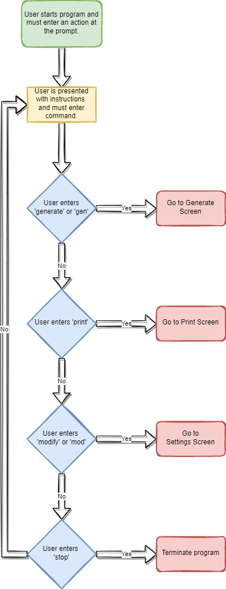
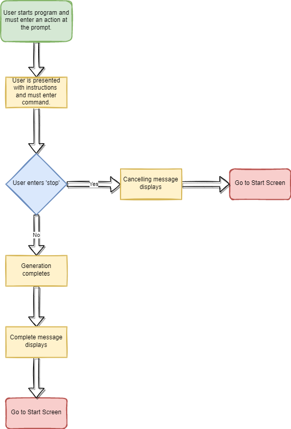

This application scans through a set of websites and creates libraries of vocabulary for various languages. The goal of this application is to use the vocabulary libraries for targeted language learning. With a general website crawl, the most common words for a language can be used to make flashcards. In other scenarios, specific websites or topics can be explored to gather a more subject-specific vocabulary list. For example, if you work in the biology industry, you can use this tool to crawl biology-related sites to build a specific set of target words.

The application can be broken down into a number of stages, each with a specific set of behaviour.

## Start Screen ##

In this stage, users will need to configure the types of URLs that will be used to generate vocabulary lists. This will be pre-configured, but can modified by the user. Users can perform the following behaviour
  - Generate vocabulary using existing settings and updating internal databases and goes to ## Generation Screen ##
  - Print existing database to certain file format (.csv) goes to Print Screen
  - Modify settings and go to the Settings Screen

## Generation Screen ##
On this screen, users have started a round of vocabulary generation. This screen does the following
  - Shows the current progress of the generation
  - The program will add counts of words to the database providing a total count of the words
  - URLs will be tracked to avoid duplicates appearing in the database. These URLs will be skipped.
  - The database word counts will, initially be wiped back to 0 and the count will be readjusted

## Print Screen ##
Here users print their target vocabular to file. This file can be used for different flashcard applications, like Anki.
  - User specifies how many words to print (out of a total count)
    - User specifies saving directory and file name (opens prompt if *)
      - User confirms to save a generically named file to the current directory
      - Users denies and reverts to directory naming
    - Users exits if no command entered

## Settings Screen ##
In this area, users can modify the URLs that will be used to generate vocabulary. Here they can do the following
  - Users can erase all existing URLs
  - Users can remove an existing URL and go to the Remove URL Screen
  - Users can add a new URL and go to the Add URL Screen

## Remove URL Screen ##
In this area, users are presented with a list of URLs. They can
  - Scroll through multiple pages of URLs if there are enough URLs to do so
  - Selected a URL via a number (opens a prompt)
    - Users can confirm they want to remove the URL
    - Users can deny removing the URL and return to the list of URLs

## Add URL Screen ##
In this screen users can add and customise their new URL
  - Users must specify whether the URL has a numeric portion where different numbers produce different web pages (a sequential URL) or is a base URL
  - Users must enter the URL. For sequential URLs, it must contain a token like <<>>
  - The URL will be validated and can only contain one type of iterator (there would be massive scaling issues otherwise)
  - This is useful primarily for websites lie project Gutenberg where the different books are accessed based on id

